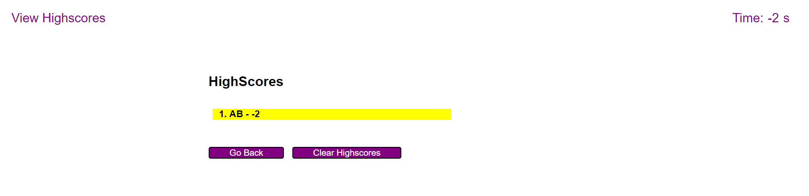

# Code Quiz

## Description

This project aims to develop a timed quiz that tests user's coding knowledge. The quiz will contain several questions and the user will obtain a final score after attempting all questions.

## Work Performed

### <ins>User-friendly start page</ins>

The start page contains detailed quiz instructions, a time, a start button, and a link to view high scores.

### <ins>Multiple choice questions </ins>

The user will be shown with a list of multiple choice questions. The timer will start as soon as the user clicks "start quiz". The user will be notified if they answer correctly after making the choices.

### <ins> Final score</ins>

After the timer runs out or the user finishes answering all the questions, a final score will be shown and the user can enter initials to save the score.

### <ins> View high scores</ins>

The user can click the "View Highscores" link on the top left corner of the page to view past scores and can choose to go back to the main page or clear all previous scores.

## Link to Work

[GitHub](https://github.com/xzhw39/edward-xu-mars)

[Deployed Website](https://xzhw39.github.io/edward-xu-mars/)

